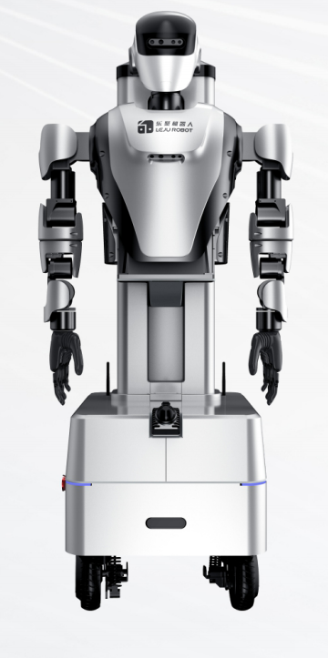
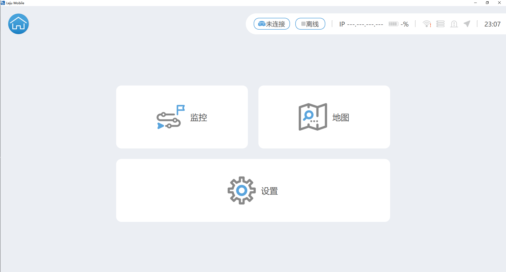
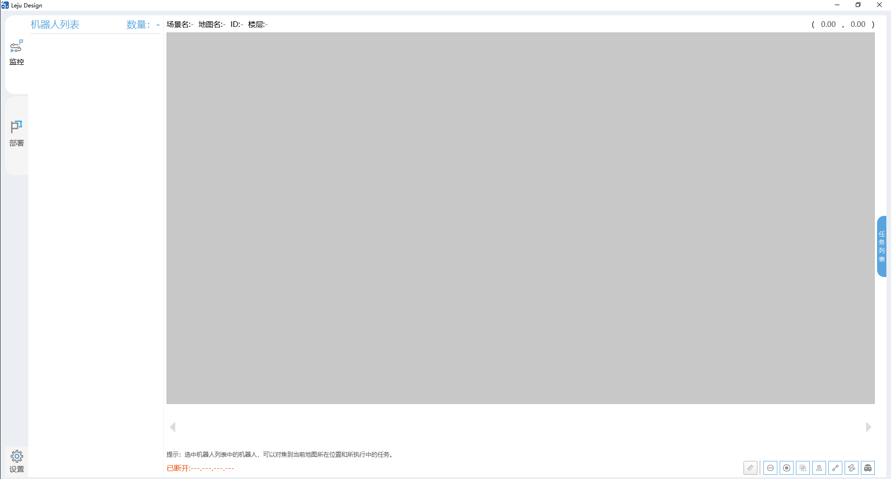
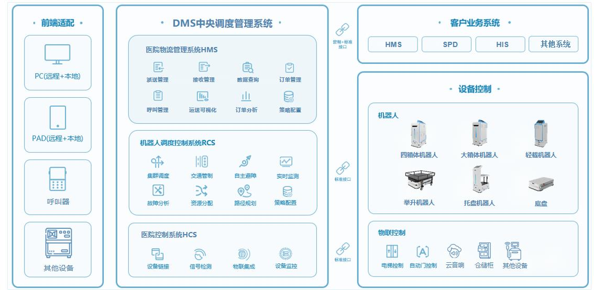

# 轮臂系列产品介绍
- [轮臂系列产品介绍](#轮臂系列产品介绍)
  - [说明](#说明)
  - [产品参数](#产品参数)
  - [配套软件](#配套软件)
  - [多机调度](#多机调度)
  - [开发接口](#开发接口)

## 说明
- 轮臂系列产品采用 `kuavo机器人上肢` + `轮式底盘` + `升降模组` 三合一模式组成，同时兼具人形上肢的灵活性以及轮式底盘的快速移动特点

   

## 产品参数

| 参数 | 值 |
|---|---|
| 产品名称 | 轮臂式具身智能机器人 |
| 整机尺寸 | 563\*630\*1250mm |
| 整机自重 | 120kg |
| 高度升降 | 600mm垂直调节 |
| 升降速度 | 0.15m/s |
| 头部自由度 | 2 |
| 手臂自由度 | 7 |
| 灵巧手自由度 | 6 |
| 视觉感知传感器 | 3个 (底盘1/头1/胸1) |
| 末端灵巧手负载 | 单只3kg |
| 驱动方式 | 四轮驱动 |
| 导航方式 | 基于激光雷达的自主导航 |
| 导航最大速度 | 1.5m/s |
| 最小转弯半径 | 0mm (原地转弯) |
| 最小通过宽度 | 930mm |
| 续航时间 | ≥8h |
| 充电时间 | 2h |
| 充电方式 | 手动/自动 |
| 爬坡角度 | 5° |
| 软件支持 | PC端、iPad端软件支持 | 

## 配套软件

1. `Leju Mobile`
   - 下载链接：xxxx
   - 支持系统：安卓、windows
   

1. `Leju Design`
   - 下载链接：xxxx
   - 支持系统：windows
   

## 多机调度
- 底盘支持额外选配调度系统，实现多机任务智能调度，道路交管等功能
- 调度系统架构图

## 开发接口
- [轮臂基础使用](../5功能案例/轮臂案例/基础使用.md)