# 机器人关节标定

- [机器人关节标定](#机器人关节标定)
  - [Kuavo 4 Pro 零点标定](#kuavo-4-pro-零点标定)
    - [工装块](#工装块)
    - [工装块的安装](#工装块的安装)
    - [腿部零点标定](#腿部零点标定)
    - [手臂自动标定](#手臂自动标定)
    - [头部自动标定](#头部自动标定)
    - [摆正标定](#摆正标定)
  - [Kuavo 5代零点标定](#kuavo-5代零点标定)
    - [1.插入工装](#1插入工装)
    - [2.启动标定](#2启动标定)

## Kuavo 4 Pro 零点标定

### 工装块

一共需要 10 个工装块，使用时两两为一组对称。

### 工装块的安装

安装顺序为从下到上，按照图中的孔位插入工装，插入后如右图所示。

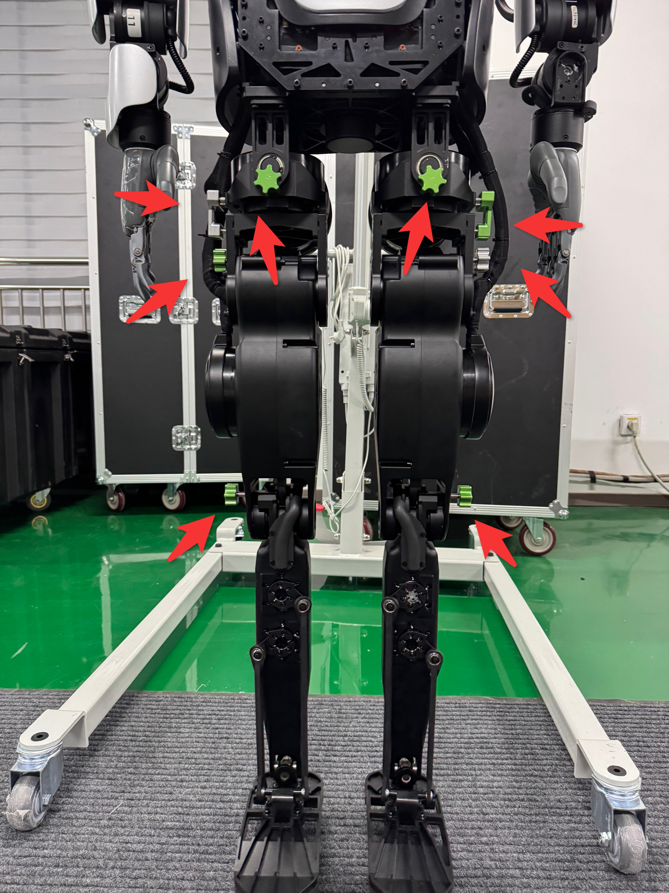

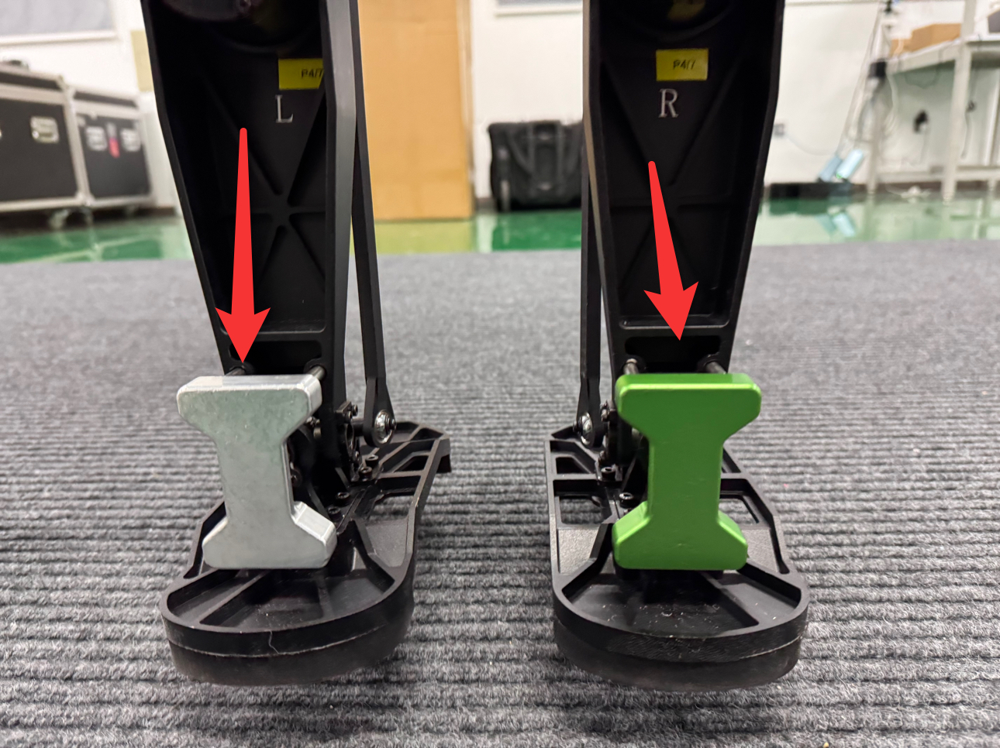

### 腿部零点标定

1. 安装完工装后，通过 SSH 连接到机器人，摆正机器人头部以及手臂，在远程的 SSH 连接终端中输入下列命令：

   ```bash
   cd ~/kuavo-ros-opensource
   sudo su
   source devel/setup.bash
   roslaunch humanoid_controllers load_kuavo_real.launch cali:=true cali_leg:=true
   ```

2. 程序运行的终端会一直存在输出，需要注意查看。如有必要可以拖动终端一侧的滑动栏上下滑动，在之前的输出中查找是否存在相关输出。腿部电机使能后，终端会有如下代码块的输出：

   ```yaml
   0000017193: Joint 1, Slave 1 actual position 9.6411132,Encoder 63184.0000000
   0000017195: Rated current 30.0000000
   0000017197: Joint 1, Slave 1 转向= 6
   0000017209: Read Joint 1, Slave 1 init kp value 220, and set kp value 220 successfully
   0000017209: Read Joint 1, Slave 1 init kd value 2979, and set kd value 2979 successfully
   0000017211: Joint 2, Slave 2 actual position 25.7645874,Encoder 93806.0000000
   0000017213: Rated current 20.0000000
   0000017215: Joint 2, Slave 2 转向= 6
   0000017227: Read Joint 2, Slave 2 init kp value 100, and set kp value 100 successfully
   0000017227: Read Joint 2, Slave 2 init kd value 5376, and set kd value 5376 successfully
   0000017229: Joint 3, Slave 3 actual position 18.2463684,Encoder 66433.0000000
   0000017231: Rated current 40.0000000
   0000017233: Joint 3, Slave 3 转向= 6
   0000017245: Read Joint 3, Slave 3 init kp value 224, and set kp value 224 successfully
   0000017245: Read Joint 3, Slave 3 init kd value 10794, and set kd value 10794 successfully
   0000017247: Joint 4, Slave 4 actual position -58.7013244,Encoder -384705.0000000
   0000017249: Rated current 40.0000000
   0000017251: Joint 4, Slave 4 转向= 6
   0000017263: Read Joint 4, Slave 4 init kp value 224, and set kp value 224 successfully
   0000017263: Read Joint 4, Slave 4 init kd value 10794, and set kd value 10794 successfully
   0000017265: Joint 5, Slave 5 actual position 34.8202514,Encoder 456396.0000000
   0000017267: Rated current 6.1000000
   0000017269: Joint 5, Slave 5 转向= 6
   0000017281: Read Joint 5, Slave 5 init kp value 58, and set kp value 58 successfully
   0000017281: Read Joint 5, Slave 5 init kd value 3136, and set kd value 3136 successfully
   0000017283: Joint 6, Slave 6 actual position -44.3365478,Encoder -581128.0000000
   0000017285: Rated current 6.1000000
   0000017287: Joint 6, Slave 6 转向= 6
   0000017299: Read Joint 6, Slave 6 init kp value 58, and set kp value 58 successfully
   0000017299: Read Joint 6, Slave 6 init kd value 3136, and set kd value 3136 successfully
   0000017301: Joint 7, Slave 7 actual position 3.5322570,Encoder 23149.0000000
   0000017303: Rated current 30.0000000
   0000017305: Joint 7, Slave 7 转向= 6
   [ INFO ][2026-06-29-09:01:24][/mobile_manipulator_controllers_node]: [MobileManipulatorController] Waiting for observation...
   0000017317: Read Joint 7, Slave 7 init kp value 220, and set kp value 220 successfully
   0000017317: Read Joint 7, Slave 7 init kd value 2979, and set kd value 2979 successfully
   0000017319: Joint 8, Slave 8 actual position 16.0600891,Encoder 58473.0000000
   0000017321: Rated current 20.0000000
   0000017323: Joint 8, Slave 8 转向= 6
   0000017335: Read Joint 8, Slave 8 init kp value 100, and set kp value 100 successfully
   0000017335: Read Joint 8, Slave 8 init kd value 5376, and set kd value 5376 successfully
   0000017337: Joint 9, Slave 9 actual position 34.8082580,Encoder 126733.0000000
   0000017339: Rated current 40.0000000
   0000017341: Joint 9, Slave 9 转向= 6
   0000017353: Read Joint 9, Slave 9 init kp value 224, and set kp value 224 successfully
   0000017353: Read Joint 9, Slave 9 init kd value 10794, and set kd value 10794 successfully
   0000017355: Joint 10, Slave 10 actual position -53.2159423,Encoder -348756.0000000
   0000017357: Rated current 40.0000000
   0000017359: Joint 10, Slave 10 转向= 6
   0000017371: Read Joint 10, Slave 10 init kp value 224, and set kp value 224 successfully
   0000017371: Read Joint 10, Slave 10 init kd value 10794, and set kd value 10794 successfully
   0000017373: Joint 11, Slave 11 actual position -28.2884979,Encoder -370783.0000000
   0000017375: Rated current 6.1000000
   0000017377: Joint 11, Slave 11 转向= 6
   0000017389: Read Joint 11, Slave 11 init kp value 58, and set kp value 58 successfully
   0000017389: Read Joint 11, Slave 11 init kd value 3136, and set kd value 3136 successfully
   0000017391: Joint 12, Slave 12 actual position 39.4952392,Encoder 517672.0000000
   0000017393: Rated current 6.1000000
   0000017395: Joint 12, Slave 12 转向= 6
   0000017407: Read Joint 12, Slave 12 init kp value 58, and set kp value 58 successfully
   0000017407: Read Joint 12, Slave 12 init kd value 3136, and set kd value 3136 successfully
   0000017410: Joint 13, Slave 13 actual position 20.7485046,Encoder 75543.0000000
   0000017412: Rated current 30.0000000
   0000017414: Joint 13, Slave 13 转向= 6
   0000017425: Read Joint 13, Slave 13 init kp value 220, and set kp value 586 successfully
   0000017425: Read Joint 13, Slave 13 init kd value 2979, and set kd value 4100 successfully
   0000017427: Joint 14, Slave 14 actual position -3.7872619,Encoder -13789.0000000
   0000017429: Rated current 30.0000000
   0000017431: Joint 14, Slave 14 转向= 6
   0000017443: Read Joint 14, Slave 14 init kp value 220, and set kp value 586 successfully
   0000017443: Read Joint 14, Slave 14 init kd value 2979, and set kd value 4100 successfully
   0000017443: App setup down!
   ```  

其中 `Slave xx actual position` 之后的数值为当前零点。

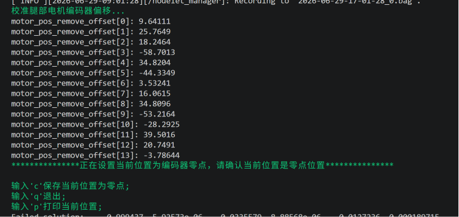

3. 跟随提示操作，按 `c` 加回车，保存腿部当前位置作为零点。随后，按 `q` 加回车退出程序，此时腿部零点标定完成，拔下工装便可正常使用。

### 手臂自动标定

1. 新建一个终端，输入下列命令（**注意：后续"标定手臂"和"标定头部"的操作均在此终端进行**）：

   ```bash
   cd ~/kuavo-ros-opensource
   sudo su
   source devel/setup.bash
   # 以校准模式启动
   roslaunch humanoid_controllers load_kuavo_real.launch cali:=true cali_arm:=true 
   ```

2. 使用移位机将机器人拉高，并按下图大致将手臂和头部摆正。

   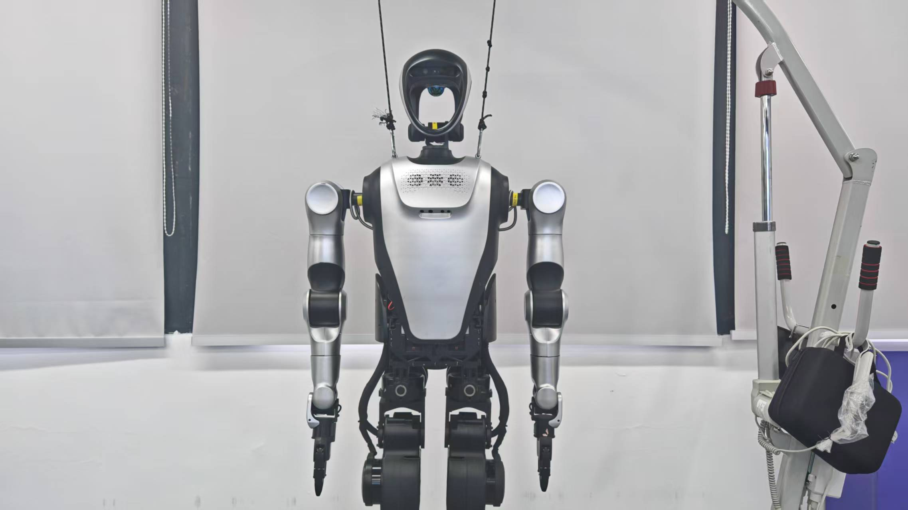

3. **注意：由于标定过程手臂会在一定范围内运动，所以开始手臂标定前，需要给机器人前后各预留大概一米的活动空间。** 等待机器人将腿伸直后，根据提示依次输入 `a`、`1`、`1`，每次输入完成后都需按下回车。

   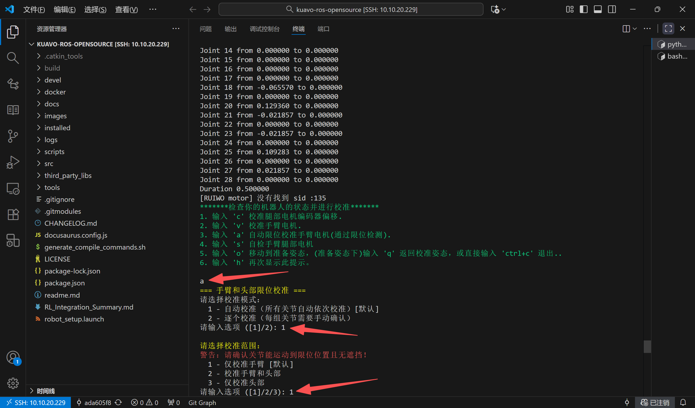

4. 等待机器人手臂标定完成并复位，终端会弹出提示，按 `s` 并回车即可保存手臂零点。

   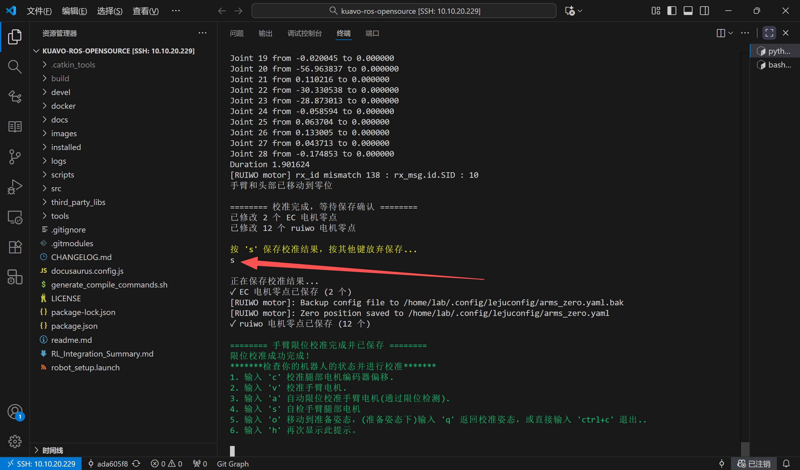

### 头部自动标定

1. 移位机下降至机器人双足稳定接触地面，如下图：

   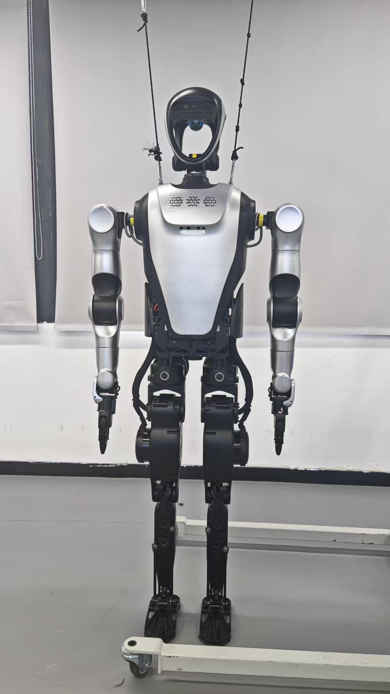

2. 用手在后面拖住机器人，移位机继续下降，令机器人双肩的挂绳环扣接近水平，如下图：

   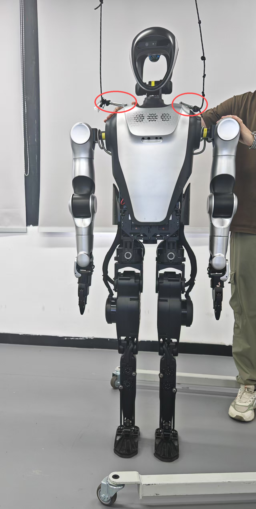

3. 若已退出或新建终端，可在终端输入下列命令启动；后续操作均为根据提示依次输入 `a`、`1`、`3`（每次输入完成后都需按下回车）：

   ```bash
   cd ~/kuavo-ros-opensource
   sudo su
   source devel/setup.bash
   # 以校准模式启动
   roslaunch humanoid_controllers load_kuavo_real.launch cali:=true cali_arm:=true 
   ```

   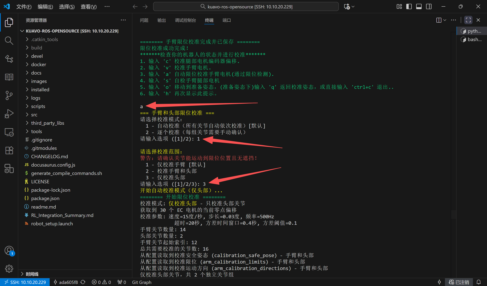

4. 等待机器人头部标定完成并复位，终端会弹出提示，按 `s` 并回车即可保存头部零点。

   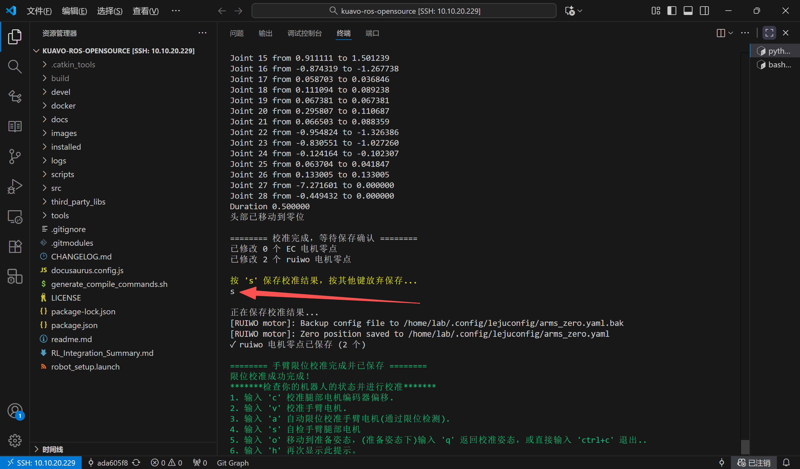

5. 移位机上拉至机器人两侧挂绳绷直，然后按 `Ctrl+C` 关闭此终端。至此头部和手臂标定结束，之后正常使用机器人即可。

### 摆正标定

将机器人手臂手动摆正（摆到期望的零位姿态），随后运行下列命令，程序会自动记录当前位置作为手臂零点：

```bash
cd ~/kuavo-ros-opensource
sudo su
source devel/setup.bash
# 以校准模式启动
roslaunch humanoid_controllers load_kuavo_real.launch cali:=true cali_arm:=true 
```

说明：该模式下程序不会驱动手臂运动，启动后即自动读取并保存当前摆正位姿为零点，同样等到以下界面出现了按 `q` 并回车退出程序即可。  


## Kuavo 5代零点标定

### 1.插入工装

正面

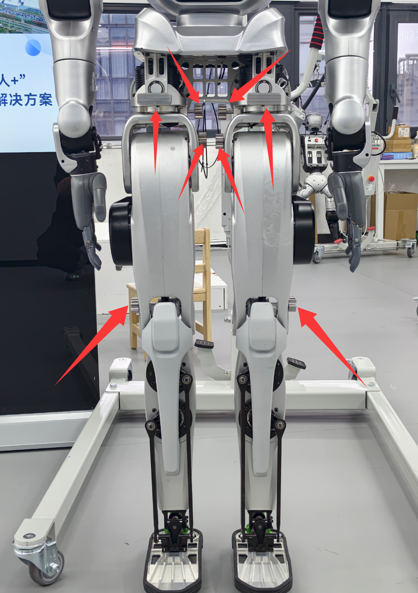

背面

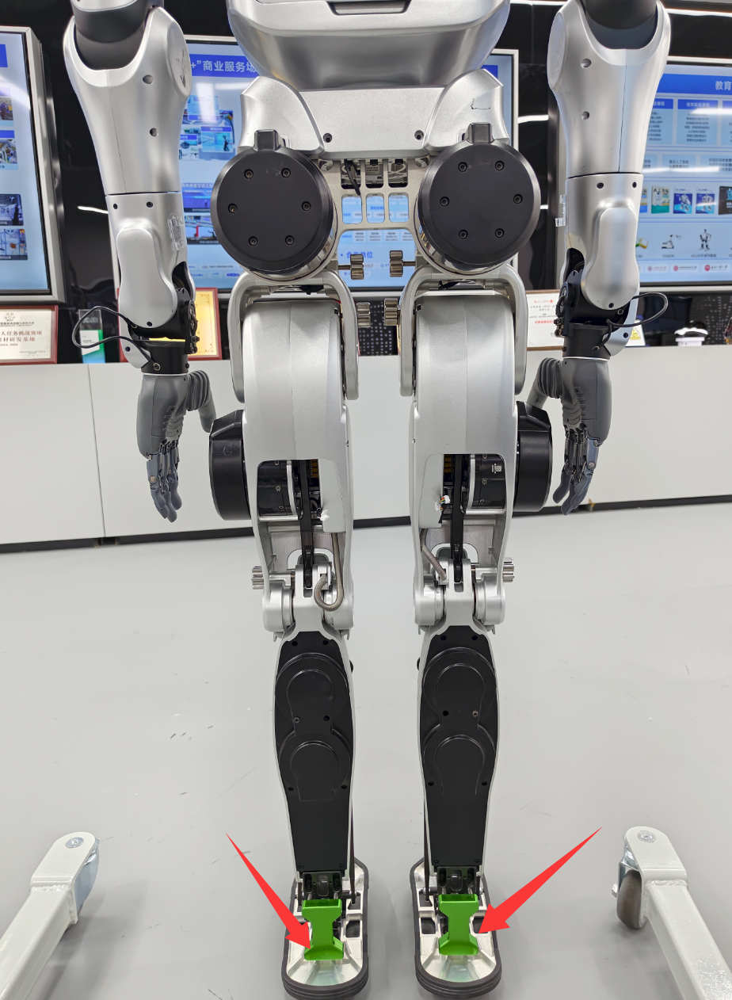

### 2.启动标定

1. 将手臂和腰部摆正后，确认工装已经正确插入。

2. 启动机器人校准程序，依次执行以下命令：

   ```bash
   cd ~/kuavo-ros-opensource
   sudo su
   source devel/setup.bash
   roslaunch humanoid_controllers load_kuavo_real.launch cali:=true cali_leg:=true cali_arm:=true
   ```
- 按照下列步骤完成零点标定：
  1. 在终端中，看到提示后，键盘输入 `c` 然后按 `Enter`，以保存当前零点位置。
  2. 确认收到保存成功的提示信息。
  3. 再输入 `q` 并按 `Enter`，退出标定程序。
- 标定完成后，可关闭终端，拔出工装。此时，零点标定已完成。

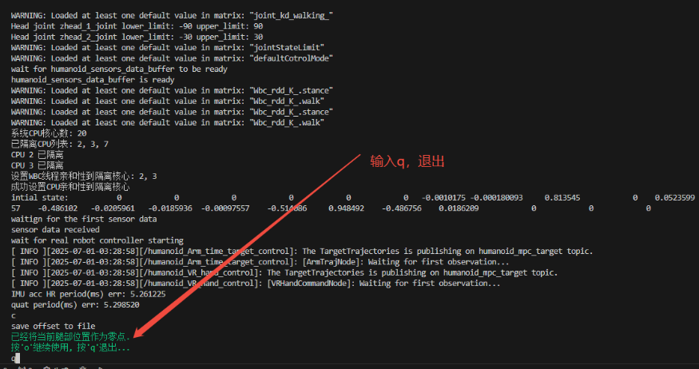

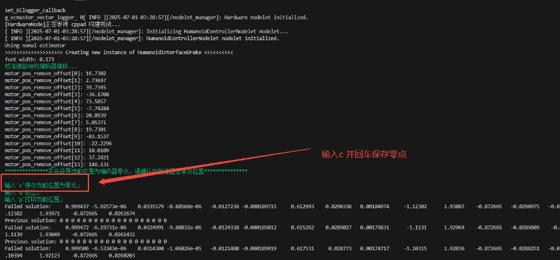